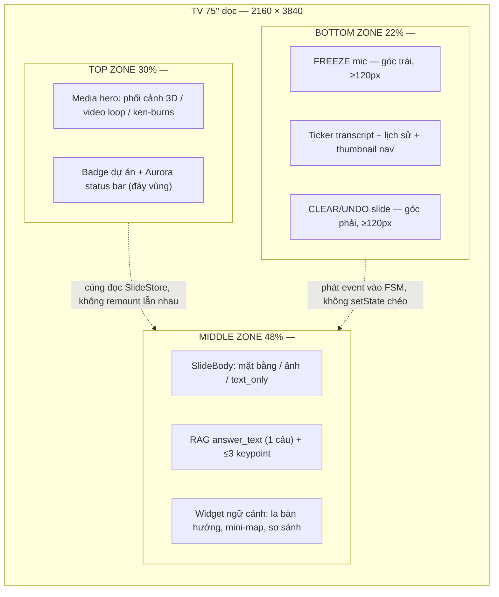
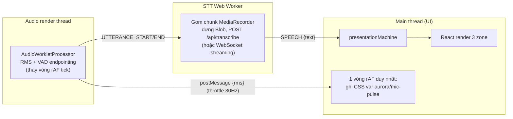
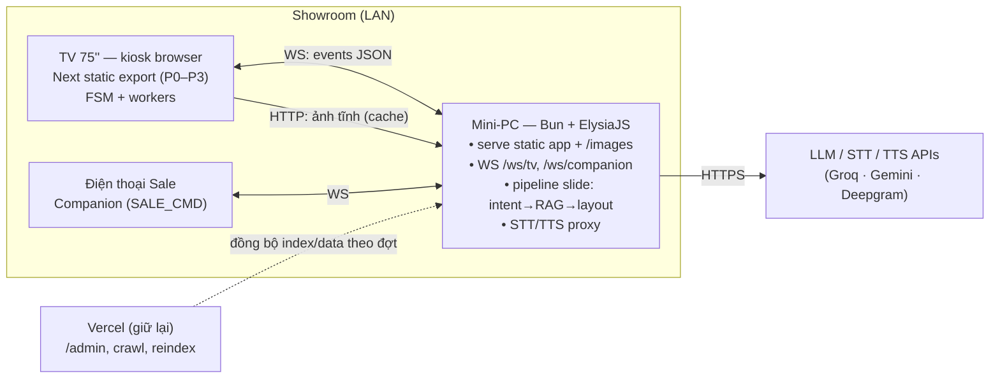

# TECH-SPEC: Màn hình dọc 75″ (9:16) — Bố cục công thái học & Kiến trúc Frontend 60 FPS

> Phạm vi: trang trình chiếu `/slide` (TV showroom), hook giọng nói `useVoiceAgent`,
> component `SlideBody`. Tài liệu này là bản thiết kế lại (layout + UX + kiến trúc code)
> kèm checklist triển khai. Mọi nhận định về hiện trạng đều dẫn chiếu file:dòng trong repo.

---

## 0. CHẨN ĐOÁN HIỆN TRẠNG — VÌ SAO GIẬT LAG?

Trước khi thiết kế lại, cần gọi tên đúng bệnh. Rà soát `app/slide/page.tsx` (790 dòng),
`components/SlideBody.tsx` (357 dòng), `hooks/useVoiceAgent.ts` (556 dòng) tìm ra các
nguyên nhân giật lag **thật sự đang nằm trong code**, xếp theo mức độ nghiêm trọng:

| # | Thủ phạm | Vị trí | Hậu quả trên TV 4K |
|---|----------|--------|--------------------|
| 1 | `setRmsVolume(rms)` gọi **trong vòng rAF của VAD** — tức React `setState` ~60 lần/giây | `hooks/useVoiceAgent.ts:203` (hàm `tick`) | Toàn bộ cây component `/slide` re-render **mỗi frame** suốt lúc mic bật. Đây là nguồn giật lớn nhất: React reconcile 60 lần/s trên DOM 4K trong khi animation slide đang chạy. |
| 2 | Vòng sáng mic scale theo `rmsVolume` bằng **inline style qua state** | `app/slide/page.tsx:750-754` | Mỗi frame đổi `style.transform` thông qua re-render React thay vì ghi thẳng DOM → cộng hưởng với (1). |
| 3 | `key={replayKey}` **remount cả cây slide** khi đổi slide | `components/SlideBody.tsx:190,238,309` + bump key tại `app/slide/page.tsx:433-434` | Remount = huỷ toàn bộ DOM cũ, dựng DOM mới, decode lại ảnh, chạy lại mọi animation → khựng rõ ở khung chuyển cảnh (main-thread spike). Đã có vá "sameSlide" (`page.tsx:415-436`) nhưng chỉ chặn được trường hợp trùng slide. |
| 4 | `transition-all` trên ảnh crossfade | `components/SlideBody.tsx:269` | Transition áp cho **mọi** property, gồm cả property gây layout (aspect-ratio của `<figure>` đổi khi `ratios` load xong) → reflow từng frame thay vì chỉ compositor. |
| 5 | `aspectRatio` của khung ảnh đổi **sau khi ảnh load** (đo runtime) | `components/SlideBody.tsx:262,272-277` | Layout shift giữa chừng animation vào slide; kết hợp (4) thành reflow có animation. |
| 6 | Nền mờ full-màn: ảnh 4K `scale-110 blur-[3px] brightness-[0.26]` + các chip `backdrop-blur` | `components/SlideBody.tsx:180`, `page.tsx:560,725-747` | `filter: blur` trên bề mặt 3840×2160+ là paint cực đắt với SoC của TV; `backdrop-blur` buộc repaint vùng phía sau mỗi frame khi có animation chạy bên dưới. |
| 7 | Toàn bộ pipeline âm thanh chạy **trên main thread**: RMS tính trong rAF, MediaRecorder chunk 250ms, dựng Blob, upload | `useVoiceAgent.ts:197-226,364-402` | Tranh CPU trực tiếp với render loop. Khi khách nói liên tục, mỗi lần chốt câu là một cụm việc đồng bộ chen giữa các frame. |
| 8 | **God component + rừng cờ ref**: `isGeneratingRef`, `pha1Xong`, `lastQueryRef`, `transcribingRef`, `isListeningLoopActive`, `isRecognitionRunningRef`, `chatStateRef`, `slideKeyRef`, `pausedRef`… | `page.tsx:57-144`, `useVoiceAgent.ts:41-68` | Logic chuyển trạng thái rải trong ~15 callback + 3 watchdog/timeout. Không ai nhìn được "hệ thống đang ở trạng thái nào" → chính là "logic chồng chéo trong layout rendering path" mà ta đang trả giá. |
| 9 | Preload ảnh là **danh sách cứng 25 đường dẫn** | `page.tsx:477-509` | Tải cả ảnh không bao giờ dùng, không tải ảnh chủ đề khách đang nói; ảnh gốc full-res decode trên main thread đúng lúc slide vào. |
| 10 | 2 interval nền (idle photo 7s, image rotate 2.5s) + watchdog 1.2s + failsafe `getComputedStyle`/`getBoundingClientRect` | `page.tsx:49-53,153-168`, `SlideBody.tsx:96-103`, `useVoiceAgent.ts:527-531` | Từng cái nhỏ, nhưng cộng lại là timer nổ lệch pha với rAF; failsafe ép forced-layout (chấp nhận được vì chạy 1 lần/slide — giữ, nhưng phải nằm ngoài lúc animation chạy). |

**Kết luận chẩn đoán:** giật lag không phải do "animation CSS sai" — keyframes hiện tại
(`lineUp`, `imgIn`, ken-burns) đã đúng chuẩn transform/opacity. Vấn đề là **main thread bị
React re-render 60fps từ VAD (1)(2), remount cả cây khi chuyển cảnh (3), và paint nặng
từ blur 4K (6)**. Ba việc này phải sửa trước, các việc còn lại là tái cấu trúc để bệnh
không tái phát.

---

## PHẦN 1 — BỐ CỤC CÔNG THÁI HỌC MÀN DỌC 75″ (PORTRAIT ERGONOMICS)

### 1.1. Số liệu vật lý làm gốc

TV 75″ dọc: khung hình ≈ **93 cm (ngang) × 166 cm (cao)**. Treo sao cho mép dưới cách sàn
~35–45 cm thì mép trên ở ~2,0–2,1 m. Từ đó suy ra 3 dải công thái học:

- **Vùng trên cao** (~1,55 m → 2,1 m so với sàn): trên tầm mắt, chỉ hợp với hình ảnh
  "ngắm" — không đặt chữ nhỏ, không đặt nút.
- **Vùng ngang tầm mắt** (~1,05 m → 1,55 m): tầm mắt người đứng 2–4 m, vùng đọc chính.
- **Vùng tầm tay** (~0,35 m → 1,05 m): trong tầm với thoải mái khi đứng sát màn — vùng
  chạm duy nhất hợp lệ (WCAG 2.5.8 + tránh với tay quá vai).

Quy ra tỷ lệ chiều cao màn hình:

| Vùng | Tỷ lệ cao | Pixel @ 2160×3840 | Vai trò |
|------|-----------|--------------------|---------|
| TOP — Cinematic | **30%** | ~1152 px | Trình diễn, cảm xúc |
| MIDDLE — Focus | **48%** | ~1843 px | Nội dung RAG, đọc hiểu |
| BOTTOM — Control | **22%** | ~845 px | Chạm/điều khiển của Sale + ticker |

### 1.2. Sơ đồ layout (ASCII)

```
┌─────────────────────────────────────────────┐  ← 2,10 m (mép trên TV)
│  TOP ZONE — "SÂN KHẤU"                 30%  │
│  ┌───────────────────────────────────────┐  │
│  │  Phối cảnh 3D / flycam ken-burns      │  │   • KHÔNG chữ nhỏ, không nút
│  │  (video loop khi idle, ảnh hero       │  │   • Chỉ 1 lớp media + 1 badge
│  │   của chủ đề khi có slide)            │  │     dự án góc trên
│  │  Badge: NY'AH PHÚ ĐỊNH  ○ Đang nghe   │  │   • Trạng thái AI = dải sáng
│  └───────────────────────────────────────┘  │     mảnh ở đáy vùng (aurora)
├─────────────────────────────────────────────┤  ← ~1,55 m  (ngang trán)
│  MIDDLE ZONE — "TIÊU ĐIỂM"             48%  │
│  ┌───────────────────────────────────────┐  │
│  │  Slide chính:                         │  │   • Mặt bằng căn hộ + callout
│  │   - Mặt bằng / ảnh nội thất           │  │     thông số dán SÁT vùng
│  │   - answer_text của RAG (1 câu)       │  │     tương ứng (Gestalt)
│  │   - Tối đa 3 keypoint + logo NCC      │  │   • Typo scale đọc được ở 4 m
│  │   - La bàn hướng / mini-map khi nói   │  │   • Đây là vùng eye-level —
│  │     về hướng/vị trí                   │  │     mọi thứ cần ĐỌC nằm ở đây
│  └───────────────────────────────────────┘  │
├─────────────────────────────────────────────┤  ← ~1,05 m  (ngang khuỷu tay)
│  BOTTOM ZONE — "BUỒNG LÁI CỦA SALE"    22%  │
│  ┌─────────┐ ┌─────────────────┐ ┌───────┐  │
│  │ ⏸ FREEZE│ │ Transcript/lịch │ │ 🗑 CLEAR│  │   • 2 nút khẩn ở 2 GÓC dưới
│  │  (mic)  │ │ sử câu hỏi +    │ │ (undo) │  │     (Fitts: góc = đích vô hạn)
│  │ ≥120px  │ │ trạng thái mic  │ │ ≥120px │  │   • Giữa: ticker transcript,
│  └─────────┘ │ + thumbnail nav │ └───────┘  │     thumbnail strip, chip topic
│              └─────────────────┘            │   • Toàn bộ touch-target ≥ 120px
└─────────────────────────────────────────────┘  ← 0,35–0,45 m (mép dưới TV)
```

### 1.3. Sơ đồ Mermaid (kèm phân công component)



### 1.4. Quy tắc dựng khung (code)

Một grid duy nhất, không lồng flex tự do như hiện tại (hiện `/slide` là 1 cột flex
tự chia — `page.tsx:594-717` — mọi thứ nổi tự do bằng `absolute`):

```tsx
// app/slide/layout-shell.tsx
<div className="h-screen overflow-hidden grid"
     style={{ gridTemplateRows: '30cqh 48cqh 22cqh', containerType: 'size' }}>
  <HeroStage   />   {/* vùng trên — chỉ media, contain: strict */}
  <FocusCanvas />   {/* vùng giữa — SlideBody mới */}
  <SaleConsole />   {/* vùng dưới — điều khiển, KHÔNG remount theo slide */}
</div>
```

- Mỗi vùng đặt `contain: layout paint style` (hoặc `content-visibility: auto` cho vùng
  không hoạt động) để đổi nội dung vùng này **không invalidate layout** vùng khác.
- `SaleConsole` **không nằm trong** cây `key={replayKey}` — hiện nút mic/chip trạng thái
  nằm chung cây với slide (`page.tsx:723-768`) nên mỗi lần đổi slide là mọi thứ vẽ lại.
- Ba chế độ nội dung: **Idle/Attract** (TOP tràn xuống 78%, BOTTOM giữ nguyên),
  **Presenting** (30/48/22), **Zoom mặt bằng** (MIDDLE tràn 78%, TOP thu thành dải 8%
  chứa badge). Chuyển chế độ bằng `transform: translateY/scale` trên từng vùng —
  **không đổi grid-template-rows theo animation** (đổi row = reflow cả trang; snap
  chế độ thì đổi 1 lần rồi thôi, chấp nhận 1 reflow/lần chuyển chế độ).

**Vì sao TOP không đặt nội dung đọc:** góc ngửa cổ >15° gây mỏi sau ~2 phút; khách xem
phối cảnh theo kiểu "liếc ngắm" nên vùng này chỉ cần đẹp và chuyển động chậm (ken-burns
20–30s/chu kỳ, đã có sẵn `animate-ken-burns`). **Vì sao BOTTOM không đặt nội dung khách
cần đọc:** người đứng 3 m nhìn xuống 0,7 m là góc cúi ~25° — chữ vùng này chỉ phục vụ
Sale đứng **sát màn**, nên được phép nhỏ hơn (nhưng nút phải to — xem Fitts §2.4).

---

## PHẦN 2 — UX/UI CHI TIẾT THEO TIÊU CHUẨN

### 2.1. Trạng thái hệ thống & trực quan hoá RAG

**Nielsen #1 — Visibility of system status, phong cách "ambient", không phá mạch cảm xúc.**

Nguyên tắc: *trạng thái là ánh sáng, không phải hộp thoại.* Hiện tại trạng thái là chip
chữ "Đang suy nghĩ…" + spinner (`page.tsx:694-696,735-738`) — đúng thông tin nhưng sai
sân khấu: nó là ngôn ngữ dashboard, không phải gallery.

Thiết kế lại thành **Aurora Status Bar** — dải sáng cao 6–8 px nằm ở đáy TOP zone,
chạy suốt bề ngang:

| Trạng thái FSM | Aurora | Mô tả chuyển động |
|----------------|--------|--------------------|
| `idle` | tắt (opacity 0.15, màu be) | tĩnh |
| `listening` | xanh ngọc `#2E9E5B`, gợn theo RMS | biên độ gợn = âm lượng mic (ghi thẳng DOM, xem §3.2) |
| `heard` (bắt được chủ đề) | lóe vàng `#e8b84b` 400ms, kèm chip "Không gian & Công năng" (TOPIC_LABELS có sẵn `page.tsx:26-34`) | lóe rồi trở lại gợn |
| `querying` | vệt sáng chạy trái→phải (shimmer) | tốc độ cố định, KHÔNG spinner giữa màn |
| `displaying` | fade về tĩnh | — |
| `degraded` (lỗi) | hổ phách thở chậm 3s/nhịp | không đỏ, không icon lỗi |

Toàn bộ animate bằng `transform: translateX` + `opacity` trên 1 phần tử cao 8px →
compositor-only, chi phí gần bằng 0. Khách cảm nhận "hệ thống đang sống" bằng thị giác
ngoại vi, không bao giờ phải đọc chữ trạng thái.

**Nielsen #2 — Match with the real world: hướng nhà, view, khoảng cách.**

Khi transcript chứa từ khoá không gian (đã có tầng intent `lib/intent.ts` để móc vào):

- **"hướng Đông Nam"** → widget **La bàn** ở góc MIDDLE: đĩa la bàn tối giản (1 vòng
  tròn + kim + 8 hướng chữ), kim xoay `transform: rotate()` đến hướng nói, mũi kim
  vàng `#e8b84b`. Nếu slide đang là mặt bằng: vẽ thêm mũi tên hướng **đè đúng góc
  của bản vẽ** (mỗi ảnh mặt bằng khai báo `northAngle` trong manifest — xem §3.4).
- **"view sông Sài Gòn" / "gần chợ Bình Điền"** → **mini-map vệ tinh tĩnh** (ảnh
  pre-render, không nhúng Google Maps live — WebGL map trên TV là án tử FPS): dự án
  ghim vàng, đối tượng nhắc đến ghim xanh, đường nối + nhãn "18 phút" (số liệu đã có
  trong catalog `lib/static_slides.ts`). QR maps giữ nguyên cơ chế `QrChip` hiện có
  (`SlideBody.tsx:136-151`) nhưng dời xuống BOTTOM zone cho khách quét ngang tầm tay.
- **"tim tường / thông thủy"** → không chỉ đọc số: tô overlay ranh đo lên bản vẽ
  (2 nét màu khác nhau + chú thích sát cạnh — xem Gestalt §2.3).

**Nielsen #8 — Aesthetic & minimalist, "gallery, not dashboard".**

Ngân sách hiển thị mỗi slide (enforce ở tầng render, không tin LLM):

- 1 tiêu đề (≤ 40 ký tự — cắt ở server prompt lẫn client).
- 1 `answer_text` ≤ 2 dòng ở khổ chữ đích (đã là hướng đi hiện tại — `SlideBody.tsx:163-174` chỉ render answer_text, đúng; giữ).
- ≤ 3 keypoint, mỗi cái ≤ 6 từ + tối đa 1 logo thương hiệu (không icon trang trí).
- ≥ 55% diện tích MIDDLE là ảnh hoặc khoảng trắng. Không bento-grid, không card lồng card.
- Bảng màu giữ theo `DESIGN.md`: nền tối `#0b0c12`, chữ trắng, nhấn vàng `#e8b84b`,
  xanh `#2E9E5B` chỉ dành cho trạng thái nghe. Tối đa 2 màu nhấn trên một slide.

### 2.2. Quyền kiểm soát của Sale & xử lý lỗi

**ISO 9241-110 (Controllability) — SaleConsole ở BOTTOM zone + Companion.**

Trên TV (BOTTOM zone, chạm trực tiếp):

| Nút | Vị trí | Hành vi | Sự kiện FSM |
|-----|--------|---------|-------------|
| **FREEZE** ⏸ | góc trái dưới, 140×140px | 1 chạm: AI ngừng nghe + đóng băng slide hiện tại (mọi rotate/ken-burns pause). Chạm lại: nghe tiếp. Trạng thái freeze hiện rõ: aurora chuyển be tĩnh + viền vùng giữa mờ đi | `SALE_FREEZE` / `SALE_RESUME` |
| **CLEAR** 🗑 | góc phải dưới, 140×140px | 1 chạm: rút slide hiện tại (trượt xuống, quay về slide trước hoặc attract). Giữ 1,5s: xoá cả phiên (về màn chờ + flush session recorder có sẵn `lib/session-digest`) | `SALE_CLEAR` / `SALE_RESET_SESSION` |
| **Thumbnail strip** | giữa | đã có phím 4/5/6 (`SlideBody.tsx:105-115`) — giữ nguyên mapping cho remote thuyết trình, thêm chạm trực tiếp | `SALE_PICK_IMAGE(i)` |
| **Chip topic + transcript ticker** | giữa, trên strip | hiện câu vừa nghe + 3 câu gần nhất (đã có `recentRef` `page.tsx:299`); chạm vào một câu cũ = hỏi lại câu đó | `SALE_REPLAY_QUERY(text)` |
| **Sửa từ khoá** ✏ | trong ticker | chạm vào chip topic mở 1 hàng từ khoá gợi ý (từ catalog static_slides) để bẻ lái truy vấn, không cần bàn phím | `SALE_OVERRIDE_QUERY(text)` |

Companion (điện thoại Sale, phase sau): cùng bộ sự kiện FSM qua WebSocket — vì mọi điều
khiển đã là *event* nên companion chỉ là một producer sự kiện thứ hai, không thêm logic.
Đây là lợi ích trực tiếp của state machine §3.1.

Quy tắc Fitts cho cả console: nút khẩn nằm **sát mép/góc màn** (mép màn = "bức tường"
chặn tay, chiều rộng đích hiệu dụng vô hạn theo trục đó), kích thước ≥120 px (≈ 2,6 cm
trên TV 75″ — gấp ~3 lần chuẩn 44pt vì người bấm đang đứng lệch góc, không nhìn nút),
khoảng cách giữa 2 đích chạm ≥ 24 px, và **FREEZE với CLEAR ở hai góc đối diện** để
không bao giờ bấm nhầm nút nọ thành nút kia.

**Nielsen #9 — Graceful fallback: lỗi không bao giờ mặc đồ đỏ trước mặt khách.**

Hiện trạng: message lỗi thô hiện thẳng lên transcript/chip đỏ — `page.tsx:464`
(`⚠️ Lỗi tạo slide: API 500…`) và `page.tsx:724-725`. Khách không cần biết điều đó.

Thiết kế 3 tầng thoái lui, tầng nào cũng **đẹp như một slide chủ đích**:

1. **RAG không tìm thấy / server skip** → không đứng hình chờ: hiện *Ambient Slide* —
  ảnh hero đẹp nhất của chủ đề gần nhất (hoặc tổng quan dự án) + 1 câu tĩnh từ catalog.
  Aurora không đổi màu. Với khách, đó chỉ là một slide chuyển cảnh bình thường.
2. **Lỗi mạng/API** → giữ nguyên slide đang hiện (không rút, không chớp), aurora chuyển
  hổ phách thở chậm; ở BOTTOM zone (chỉ Sale đọc): dòng chữ nhỏ "Mất kết nối — đang tự
  thử lại (2/3)" + retry backoff tự động. Toast lỗi chi tiết chỉ tồn tại ở `?debug=1`
  (HUD debug hiện có `page.tsx:646-662` giữ nguyên, rất tốt).
3. **Mic chết hẳn** (not-allowed, Brave chặn — đã phát hiện sẵn `useVoiceAgent.ts:437-445,487-499`)
  → hệ thống tự chuyển "chế độ thủ công": SaleConsole nổi rõ hơn, Sale điều khiển slide
  bằng thumbnail/từ khoá; icon mic ở console gạch chéo màu be. Buổi pitch tiếp tục,
  không màn hình lỗi nào chen giữa.

Nguyên tắc chung: **khách chỉ thấy trạng thái; Sale mới thấy lỗi; kỹ thuật viên mới thấy log.**

### 2.3. Giảm tải nhận thức & Gestalt

**Gerhardt-Powals — tóm tắt thông minh vật liệu bàn giao.**

RAG trả về đoạn tài liệu thô ("Thiết bị vệ sinh: bàn cầu một khối, vòi cảm ứng, thương
hiệu Kohler hoặc tương đương…"). Tầng hiển thị ép về **Spec Card** chuẩn hoá:

```
┌──────────────────────────────────┐
│ [logo Kohler]  THIẾT BỊ VỆ SINH  │   ← logo grayscale 60%, cao 56px
│ Bàn cầu 1 khối · vòi cảm ứng     │   ← đúng 1 dòng thuộc tính
└──────────────────────────────────┘
```

- Tối đa **3 Spec Card / slide**, xếp **1 cột dọc** (khổ 9:16 hợp cột đơn — mắt quét
  trên-xuống một lần, không quét chữ Z).
- Logo thương hiệu (Kohler, Daikin, Bosch…) lưu local `public/brands/*.svg`, render
  grayscale, chỉ về màu khi card đó được nhắc đến trong hội thoại (highlight bằng
  `opacity`/`filter` transition — compositor-only).
- **So sánh 2 mẫu nhà** (Cosmo vs Fusion) trên khổ dọc: *không* kẻ bảng ma trận. Dùng
  2 cột hẹp cạnh nhau chỉ ở phần con số lớn (diện tích, tầng, PN) — mỗi hàng một chỉ
  số, con số to, nhãn chung ở giữa hàng; khác biệt thắng thế in vàng. Tối đa 4 hàng.
  Chi tiết hơn nữa → Sale bấm sang slide riêng từng mẫu.

**Gestalt Proximity — chú thích dán sát bản vẽ.**

Hiện nay caption nằm thành dải dưới ảnh (`SlideBody.tsx:288-295`) — đúng cho ảnh nội
thất, sai cho **mặt bằng**: số liệu "tim tường 82,5 m² / thông thủy 76,1 m²" đứng cách
xa vùng nó mô tả buộc khách tự map bằng trí nhớ.

Giải pháp: **manifest toạ độ hotspot theo từng ảnh mặt bằng** (mở rộng
`image_descriptions.json` sẵn có):

```json
{
  "mat_bang/opus_cau-truc-1-2-3.jpg": {
    "northAngle": 135,
    "hotspots": [
      { "id": "master",  "x": 0.62, "y": 0.31, "label": "PN Master · 18,2 m²" },
      { "id": "kitchen", "x": 0.28, "y": 0.55, "label": "Bếp · Daikin âm trần" }
    ]
  }
}
```

Render callout = chấm tròn 14px + nhãn 1 dòng, **neo theo toạ độ tỷ lệ của ảnh** (chấm
nằm trong `<figure>` cùng transform với ảnh → zoom/pan là callout đi theo, không tính
lại layout). Khi RAG nhắc đến phòng nào, callout đó sáng lên (`opacity` 0.4 → 1), các
callout khác mờ đi — sự gần gũi không gian thay cho việc đọc-rồi-tìm.

### 2.4. Typo scale cho khoảng cách 2–4 m (Viewing Distance)

Chuẩn tính: chữ đọc thoải mái cần cao ≥ 20–30 phút cung (arcminute); ở **4 m**, 25′ ≈
**2,9 cm** chiều cao chữ ≈ **67 px** trên TV 75″ 4K dọc (2160 px ngang / 93 cm →
~23,2 px/cm). Từ đó chốt thang (đơn vị `cqw` — 1cqw = 21,6 px, đã dùng đúng hướng
trong `SlideBody`):

| Cấp | Dùng cho | Kích thước | ≈px @2160w | Cao chữ thật | Đọc được từ |
|-----|----------|-----------|------------|--------------|-------------|
| Display | Tiêu đề slide, con số nổi bật | `7cqw` | ~151 px | ~6,5 cm | 8 m+ |
| Answer | `answer_text` của RAG | `3.4cqw` | ~73 px | ~3,2 cm | 4–5 m |
| Keypoint | Spec card, bullet | `2.8cqw` | ~60 px | ~2,6 cm | 3,5 m |
| Callout | Nhãn trên bản vẽ | `2.2cqw` | ~47 px | ~2,0 cm | 2,5–3 m |
| Console | Chữ BOTTOM zone (Sale đứng sát) | `1.6cqw` | ~35 px | ~1,5 cm | 1–1,5 m |

Quy tắc đi kèm: **sàn tuyệt đối 47 px** cho mọi chữ khách cần đọc (callout là cấp thấp
nhất); callout trên bản vẽ luôn kèm nền tối mờ 45% để tách khỏi nét vẽ (đừng dựa vào
`backdrop-blur` — xem §3.3); tổng chữ mọi cấp không chiếm quá ~30% diện tích MIDDLE để
bản vẽ giữ vai chính. Các `clamp()` hiện tại có floor 11–14 px (`SlideBody.tsx:157,253`)
— đó là cỡ chữ mobile, trên TV 4 m là vô hình: nâng floor theo bảng trên.

---

## PHẦN 3 — KIẾN TRÚC CODE 60 FPS

### 3.1. State Machine thay rừng cờ

**Vấn đề:** trạng thái hệ thống hiện là tích của ~8 biến cờ ref + `state` string
(danh sách ở bảng chẩn đoán #8). Ví dụ thực tế của sự chồng chéo: chống trùng câu 8s
(`page.tsx:253`), chặn generate song song (`page.tsx:246`), chống refine đè slide mới
bằng so `slideKeyRef` (`page.tsx:443-450`), watchdog hồi sinh mic 1,2s
(`useVoiceAgent.ts:527`) — bốn cơ chế guard viết ở bốn nơi, mỗi lần sửa một chỗ là dò
tay ba chỗ còn lại.

**Thiết kế FSM** (XState hoặc reducer thuần — khuyến nghị XState v5 vì có sẵn actor
cho service async, nhưng reducer + discriminated union cũng đạt):

```
        ┌─────────────────────────────────────────────────────┐
        ▼                                                     │
   ┌────────┐  MIC_ON   ┌───────────┐  TOPIC_DETECTED  ┌──────────┐
   │  idle  ├──────────►│ listening ├─────────────────►│ querying │
   │(attract)│◄─────────┤ (ambient) │◄────────┐        │ p1 ∥ p2  │
   └────────┘  MIC_OFF/ └───────────┘  SKIP/  │        └────┬─────┘
        ▲      IDLE_5MIN      ▲        ERROR──┘   SLIDE_READY│
        │                     │                              ▼
        │                     │ RESUME                 ┌────────────┐
        │               ┌─────┴────┐   SALE_FREEZE     │ displaying │
        └───────────────┤  frozen  │◄──────────────────┤ (+refining)│
          SALE_RESET    └──────────┘                   └─────┬──────┘
                                                 REFINE_READY│ (guard:
                                                             ▼  cùng slideId)
                                                       patch answer_text
```

Định nghĩa (rút gọn):

```ts
// lib/presentation-machine.ts — KHÔNG import React. Test được bằng unit test thuần.
type Ctx = {
  slide: SlideData | null;
  slideId: number;              // thay slideKeyRef
  lastQuery: { text: string; at: number };   // thay lastQueryRef
  recent: string[];             // thay recentRef
  frozen: boolean;
  micHealth: 'ok' | 'blocked' | 'denied';
};

type Ev =
  | { type: 'MIC_ON' } | { type: 'MIC_OFF' }
  | { type: 'SPEECH', text: string }          // từ STT worker
  | { type: 'TOPIC_DETECTED', intent: Intent }
  | { type: 'SLIDE_READY', data: SlideData }  // pha 1
  | { type: 'REFINE_READY', slideId: number, patch: Partial<SlideData> } // pha 2
  | { type: 'QUERY_FAILED', err: string }
  | { type: 'SALE_FREEZE' } | { type: 'SALE_RESUME' }
  | { type: 'SALE_CLEAR' } | { type: 'SALE_OVERRIDE_QUERY', text: string }
  | { type: 'IDLE_TIMEOUT' };
```

Các cờ hiện tại ánh xạ thành **guard/trạng thái tường minh**:

| Cờ hiện tại | Thay bằng |
|-------------|-----------|
| `isGeneratingRef` | đang ở state `querying` thì event `SPEECH` bị ignore theo định nghĩa state (hoặc queue 1 câu mới nhất) |
| chống lặp 8s `lastQueryRef` | guard `isDuplicate(ctx, ev)` tại transition `listening → querying` — một chỗ duy nhất |
| `pha1Xong` + so `slideKeyRef` | `REFINE_READY` mang `slideId`; guard `ev.slideId === ctx.slideId` — race pha 1/pha 2 biến mất khỏi component |
| `isListeningLoopActive` | chính là "đang ở nhánh `listening/…`" |
| watchdog mic + restart 120ms | actor `sttService` tự quản vòng đời trong worker (§3.2); FSM chỉ nhận `SPEECH`/`STT_DOWN` |

**Ràng buộc render then chốt:** component React chỉ còn là *hàm chiếu của state*:
`/slide` page ≈ 80 dòng: `const [state, send] = useMachine(presentationMachine)` +
3 zone component. Mọi `fetch` chuyển vào service của machine (invoke khi vào
`querying`, tự huỷ khi thoát state → hết luôn nhu cầu AbortController thủ công).

### 3.2. Tách luồng âm thanh khỏi UI thread

Kiến trúc đích:



Các bước cụ thể:

1. **Giết re-render theo RMS (fix quan trọng nhất).** `setRmsVolume` trong rAF
   (`useVoiceAgent.ts:203`) → thay bằng: worklet/analyser đẩy RMS vào một `ref` +
   **một vòng rAF toàn cục** ghi thẳng CSS variable, React không hề biết:

   ```ts
   // main thread — không setState
   rafLoop(() => {
     document.documentElement.style.setProperty('--mic-rms', String(rmsRef.current));
   });
   ```
   ```css
   .mic-pulse   { transform: scale(calc(1 + min(var(--mic-rms) * 5, 2))); }
   .aurora-wave { opacity: calc(.35 + var(--mic-rms) * 3); }
   /* cả hai đều compositor-only */
   ```
   Chỉ riêng bước này đã trả lại phần lớn budget frame khi mic bật.

2. **VAD/RMS sang `AudioWorkletProcessor`**: tính RMS trên audio render thread (128
   sample/block), gửi về main thread **30 Hz đã throttle** thay vì 60 lần/s. Logic
   endpointing Gemini (ngưỡng 0.045 / im lặng 900 ms / max 15 s —
   `useVoiceAgent.ts:70-73,213-224`) chuyển nguyên vào worklet: worklet chỉ bắn 2 event
   `UTTERANCE_START` / `UTTERANCE_END`.

3. **MediaRecorder + Blob + upload sang Web Worker**: chunk 250 ms chuyển thẳng vào
   worker (`postMessage` với transferable), dựng Blob + `fetch` trong worker
   (thay `handleGeminiUtterance` — `useVoiceAgent.ts:364-402`). Main thread chỉ nhận
   chuỗi kết quả. (Ghi chú: bản thân MediaRecorder phải sống ở main thread vì cần
   MediaStream, nhưng *dữ liệu và mọi xử lý sau đó* thì không.)

4. **Decode ảnh trong worker**: `createImageBitmap()` cho ảnh slide sắp hiện (prefetch
   §3.4) để việc decode JPEG 4K không chen vào frame lúc chuyển cảnh.

### 3.3. Chuẩn animation 60 FPS

**Luật cứng (đưa vào ESLint/stylelint + review checklist):**

1. Chỉ animate `transform` (`translate3d/scale/rotate`) và `opacity`. Cấm animate/transition
   `width/height/top/left/margin/aspect-ratio/filter`. Keyframes hiện tại đã đạt — vấn đề
   nằm ở các vi phạm lẻ:
   - `transition-all` → `transition-opacity` (+`transform` nếu cần) tại `SlideBody.tsx:269`
     và rà toàn repo (`grep -rn "transition-all"`).
   - `@keyframes wave` đang animate `height` (`page.tsx:623`) — 3 thanh nhỏ nhưng chạy
     vô hạn suốt phiên → đổi sang `transform: scaleY()` với `transform-origin: bottom`.
2. **Không remount để replay animation.** Bỏ `key={replayKey}` ở container
   (`SlideBody.tsx:190,238,309`). Slide mới = **2 lớp chồng** (slide cũ fade-out,
   slide mới fade/slide-in bằng transform), lớp cũ remove sau `transitionend`/timeout.
   Ảnh lớp mới đã decode sẵn từ prefetch → chuyển cảnh không có việc nặng nào ngoài
   compositor. (Cross-fade 2 lớp cũng tự sửa nốt lớp bệnh "giật remount" từng phải vá
   bằng `sameSlide` — `page.tsx:415-436`.)
3. **`aspect-ratio` không đổi lúc runtime**: tỷ lệ thật của từng ảnh nằm sẵn trong
   manifest build-time (§3.4) → bỏ đo `onLoad`/`setRatios` (`SlideBody.tsx:272-277`),
   khung ảnh đúng kích thước ngay từ frame đầu, hết layout-shift giữa animation.
4. **Blur là tài sản tĩnh, không phải filter runtime**: nền mờ tối = biến thể
   `*_bg.webp` (resize 480px + gaussian blur + darken, sinh lúc build bằng sharp)
   thay cho `blur-[3px] brightness-[0.26]` trên ảnh 4K (`SlideBody.tsx:180`).
   `backdrop-blur` chỉ được phép trên phần tử ≤ ~5% diện tích màn và không nằm đè
   vùng đang có animation.
5. **`will-change` có kỷ luật**: chỉ tồn tại trong lúc animation chạy (thêm class khi
   bắt đầu, gỡ ở `animationend`) — hiện `.line-in`/`.img-card` giữ `will-change`
   vĩnh viễn (`page.tsx:605,616`), mỗi dòng chữ một GPU layer chiếm VRAM của SoC TV.
6. **Một vòng rAF, tách read/write**: mọi hiệu ứng JS-driven (mic pulse, aurora) đi
   qua 1 scheduler rAF duy nhất, phase đọc DOM tách khỏi phase ghi (tránh layout
   thrashing); đo đạc dùng ResizeObserver/IntersectionObserver (ResizeObserver đã dùng
   đúng ở `SlideBody.tsx:80-88` — giữ). Failsafe animation check (`page.tsx:153-168`,
   forced layout 1 lần/slide) dời vào `requestIdleCallback` sau khi transition xong.
7. **TV là SoC yếu, không phải MacBook**: test trên chính TV với
   `chrome://tracing`/DevTools remote; nếu vẫn hụt frame ở 4K, render app ở 1080×1920
   (`viewport` + upscale của TV) — chữ trên khổ chữ này vẫn sắc, còn compositor nhẹ đi 4 lần.
   Tôn trọng `prefers-reduced-motion` (đã có — `page.tsx:638-643`, giữ).

### 3.4. Prefetch tài nguyên theo dòng hội thoại

Thay danh sách cứng 25 ảnh (`page.tsx:477-509`) bằng pipeline 3 tầng:

1. **Asset manifest build-time** (`scripts/build-asset-manifest.ts` → `public/asset-manifest.json`):
   quét `public/images/**` sinh `{ url, w, h, ratio, topic, bytes, bgUrl, lqip }` cho
   từng ảnh — nguồn cho: aspect-ratio tĩnh (§3.3.3), nền blur tĩnh (§3.3.4), và nhóm
   topic để prefetch. `image_descriptions.json` + cấu trúc thư mục
   (`vi_tri/`, `noi_that/cosmo_gen_2/`…) đủ để gán topic tự động.
2. **Prefetch theo intent, ngay khi vào `listening`/`heard`** — sớm hơn 2–3 s so với
   đợi slide về: FSM bắt `TOPIC_DETECTED(intent)` → gửi worker
   `PREFETCH {topic: intent.topic, detail: intent.detail}` → worker fetch (ưu tiên
   `priority: 'low'`) + `createImageBitmap` decode sẵn N ảnh đầu của topic; LRU cache
   ~150 MB. Khách nhắc "Cosmo" là ảnh Cosmo đã nằm sẵn dạng bitmap trước khi RAG trả lời xong.
3. **Warm-up khi idle**: `requestIdleCallback` prefetch dần ảnh hero các topic phổ biến
   (thống kê từ session log Telegram sẵn có) — thay thế chính thức danh sách cứng.
   Kết hợp `<link rel="preload">` cho 5 ảnh attract screen (IDLE_PHOTOS).

Ảnh phục vụ đúng cỡ hiển thị: sinh biến thể 960/1440/2160 (sharp, build-time hoặc
next/image loader) — TOP zone không bao giờ cần ảnh rộng hơn 2160, thumbnail strip chỉ
cần 240 px.

---

## PHẦN 4 — KẾ HOẠCH TRIỂN KHAI (TECH-SPEC CHECKLIST)

Nguyên tắc chia phase: **P0 dập lửa FPS ngay trên code hiện tại** (không đổi kiến trúc,
ship được trong tuần), P1 tái cấu trúc nền móng, P2 tách luồng, P3 layout 3 vùng + UX
mới, P4 chốt chất lượng. Mỗi mục ghi rõ file đích và tiêu chí nghiệm thu (DoD).

### P0 — Dập lửa hiệu năng (1–2 ngày, không đổi API/UX) — ✅ ĐÃ LÀM (PR #125)

- [x] **P0.1** Bỏ `setRmsVolume` khỏi vòng rAF: RMS ghi CSS var `--mic-rms`; mic pulse +
  sóng nghe chạy thuần CSS. Hết re-render React 60fps khi mic bật.
- [x] **P0.2** `transition-all` → `transition-opacity`/`[opacity,transform]`/`colors`.
- [x] **P0.3** `@keyframes wave` đổi `height` → `transform: scaleY`.
- [x] **P0.4** Gỡ `will-change` thường trực khỏi `.line-in`/`.img-card`.
- [x] **P0.5** Nền blur tĩnh `scripts/gen-blur-bg.mjs` → `/public/images_bg` (prebuild +
  buildCommand Vercel), fallback CSS filter khi thiếu file.
- [ ] **P0.6** Đo baseline TRƯỚC/SAU trên TV thật: DevTools remote → Performance trace 60 s
  kịch bản "khách hỏi 5 câu liên tiếp". Lưu số vào PR: % dropped frames, longest task,
  tổng thời gian style/layout. *DoD: dropped frames < 5%, không long task > 120 ms.*
  ⚠️ Làm tại showroom - cần TV thật.

### P1 — State Machine & mổ god-component (3–5 ngày) — ✅ ĐÃ LÀM

- [x] **P1.1** `lib/presentation-machine.ts` (FSM thuần TS): states `idle / listening /
  querying / frozen / mic_error`, slide là context; guard dedupe 8s, seq cho refine,
  same-slide patch, phiên khách 5 phút.
- [x] **P1.2** Unit test FSM (`bun test`, 14 test): refine về sau khi slide đã đổi, SPEECH
  trùng 8s, interim trước slide đầy đủ, FREEZE giữa querying, CLEAR vô hiệu truy vấn
  đang bay, QUERY_FAILED xoá dấu câu lặp, resume seq=-1.
- [x] **P1.3** Orchestration 2 pha chuyển vào `lib/slide-transport.ts` (HttpTransport);
  đã xoá `isGeneratingRef`, `pha1Xong`, `lastQueryRef`, `slideKeyRef`, `lastSlideRef`
  khỏi component.
- [x] **P1.4** (một phần) Tách `AttractScreen`, `DebugHud`, `SlideStage` khỏi page; page
  không còn ref trạng thái nghiệp vụ. Grid 3 vùng + `HeroStage`/`SaleConsole` trên TV
  thuộc P3 (chưa làm).
- [x] **P1.5** `components/SlideStage.tsx`: chuyển cảnh 2 lớp cross-fade, lớp cũ giữ DOM
  fade-out rồi mới unmount; nhánh vá `sameSlide` chuyển vào machine (isSameSlide →
  patch tại chỗ, không đổi slideId).

### P2 — Tách luồng âm thanh & prefetch (3–5 ngày)

- [ ] **P2.1** `AudioWorkletProcessor` (`public/worklets/vad-processor.js`): RMS + endpointing
  (ngưỡng giữ nguyên 0.045/900ms/15s), phát `UTTERANCE_START/END`, RMS throttle 30 Hz.
- [ ] **P2.2** `workers/stt.worker.ts`: nhận chunk (transferable), dựng Blob, POST
  `/api/transcribe`, retry/backoff; main thread chỉ nhận `SPEECH{text}`. Thay
  `handleGeminiUtterance` (`useVoiceAgent.ts:364-402`).
- [ ] **P2.3** `useVoiceAgent` thu gọn thành adapter mỏng: xin quyền mic, nối worklet/worker,
  bơm event vào FSM. Xoá watchdog interval + restart 120 ms (vòng đời STT tự quản trong
  service). *DoD: khi khách nói liên tục 60 s, main thread không có task nào từ pipeline
  âm thanh > 4 ms.*
- [ ] **P2.4** `scripts/build-asset-manifest.ts` → `public/asset-manifest.json`
  (url/ratio/topic/bgUrl/biến thể kích thước). Nối `SlideBody` đọc ratio tĩnh, bỏ
  `setRatios` runtime (`SlideBody.tsx:272-277`).
- [ ] **P2.5** `workers/prefetch.worker.ts`: nghe `TOPIC_DETECTED` → fetch + `createImageBitmap`
  topic liên quan, LRU 150 MB; idle warm-up thay danh sách cứng (`page.tsx:477-509`).
  *DoD: khách nhắc chủ đề mới → ảnh slide hiển thị không có network/decode tại thời điểm
  `SLIDE_READY` trong ≥ 80% lượt (đo qua debug HUD).*

### P3 — Layout 3 vùng + UX chuẩn mới (5–8 ngày, song song P2 được)

- [ ] **P3.1** Grid 3 vùng 30/48/22 + `contain`/`content-visibility` từng vùng (§1.4);
  3 chế độ Idle/Presenting/Zoom chuyển bằng transform.
- [ ] **P3.2** `HeroStage`: media hero theo topic + badge; ken-burns 20–30 s.
- [ ] **P3.3** **Aurora Status Bar** (§2.1) thay chip "Đang suy nghĩ…" + spinner giữa khách
  (`page.tsx:682-697,735-747`); map đủ 6 trạng thái FSM.
- [ ] **P3.4** `SaleConsole`: FREEZE/CLEAR 140 px hai góc đáy (Fitts §2.2), ticker transcript
  + lịch sử chạm-để-hỏi-lại, chip topic + hàng từ khoá override; giữ phím 4/5/6.
- [ ] **P3.5** Graceful fallback 3 tầng (§2.2): Ambient Slide khi skip/không tìm thấy; lỗi
  mạng giữ slide + aurora hổ phách + retry; mic chết → chế độ thủ công. Message lỗi thô
  (`page.tsx:464,724-725`) chỉ còn trong `?debug=1`.
- [ ] **P3.6** Typo scale mới theo bảng §2.4 (nâng floor clamp lên 47 px cho chữ khách đọc).
- [ ] **P3.7** Hotspot manifest cho ảnh mặt bằng + component `PlanCallouts` (Gestalt §2.3);
  widget la bàn + mini-map tĩnh cho intent hướng/vị trí (§2.1-H2).
- [ ] **P3.8** Spec Card vật liệu + logo thương hiệu local (`public/brands/`), enforce ngân
  sách hiển thị (≤3 card, ≤3 keypoint) ở tầng render.

### P4 — Chốt chất lượng & chống thoái hoá (2–3 ngày)

- [ ] **P4.1** Perf budget tự động: Playwright + CDP trace kịch bản "5 câu hỏi liên tiếp,
  4 lần chuyển slide" chạy CI; fail nếu dropped frames > 5% hoặc long task > 120 ms.
- [ ] **P4.2** Lint chặn thoái hoá: stylelint cấm transition/animation trên property layout;
  ESLint cấm `setState` trong callback rAF; grep-CI cấm `transition-all`.
- [ ] **P4.3** Soak test showroom: chạy liên tục 8 h trên TV thật, theo dõi memory (LRU ảnh,
  số GPU layer), không rò rỉ listener khi qua ~100 phiên khách.
- [ ] **P4.4** Cập nhật `DESIGN.md` (zone, aurora, typo scale mới) + `docs/REQUIREMENTS.md`;
  hướng dẫn vận hành cho Sale (FREEZE/CLEAR/override) 1 trang.

### Chỉ tiêu nghiệm thu cuối (Definition of Done toàn dự án)

| Chỉ số | Mục tiêu | Cách đo |
|--------|----------|---------|
| Frame rate khi chuyển slide | ≥ 55 FPS ổn định trên TV thật | DevTools remote trace |
| Long task main thread | không có task > 120 ms; pipeline audio < 4 ms/task | Performance trace |
| React commit khi mic bật (không đổi slide) | 0 commit/giây | React Profiler |
| Ảnh slide mới | 0 network + 0 decode tại thời điểm hiển thị (≥80% lượt) | debug HUD counter |
| Trạng thái nghiệp vụ | 100% chuyển trạng thái đi qua FSM, 0 cờ ref nghiệp vụ trong component | code review + unit test |
| Chữ khách đọc | ≥ 47 px, contrast ≥ 4.5:1 | audit script sẵn có (skill `audit`) |

---

## PHẦN 5 — KIẾN TRÚC HỆ THỐNG: FRONTEND TĨNH TRÊN TV + BACKEND BUN (WEBSOCKET)

> Định hướng đã chốt: **frontend chạy trên TV là bản tĩnh (HTML/JS thuần hoặc Next.js
> static)**, **backend chạy Bun (ElysiaJS/Hono) làm WebSocket server** đẩy dữ liệu RAG
> và ảnh lên TV. Phần này đánh giá, chốt phương án cụ thể và vạch đường di trú từ
> kiến trúc hiện tại (Next.js API routes trên Vercel).
>
> **Phạm vi:** kiến trúc này áp dụng **riêng cho luồng slide TV** (`/slide` + pipeline
> `/api/slide`, `/api/transcribe`, `/api/tts` phục vụ TV). Phần **chatbot** (`/`,
> `/voice`, `/embed`, `/api/chat`) đã ổn định — giữ nguyên trên kiến trúc hiện tại
> (Next.js + Vercel), không nằm trong đợt tái cấu trúc này.

### 5.1. Frontend: Next.js static export — chọn; HTML thuần — chưa cần

Nói thẳng một sự thật kỹ thuật trước: **60 FPS không đến từ việc bỏ framework.** Mọi
nguồn giật đã chẩn đoán ở §0 (re-render theo RMS, remount cây slide, blur 4K runtime)
là lỗi tầng ứng dụng — viết lại bằng HTML/JS thuần mà giữ nguyên các pattern đó thì vẫn
giật; ngược lại Next.js đã sửa P0–P2 thì thừa sức 60 FPS vì **trong lúc animation chạy,
React không được phép render gì cả** (đó chính là ràng buộc thiết kế ở §3.1–§3.3).

So sánh cho bối cảnh TV showroom:

| Tiêu chí | Next.js `output: 'export'` (static) | HTML/JS thuần (vanilla/Lit) |
|----------|--------------------------------------|------------------------------|
| FPS trần | 60 FPS (sau P0–P2) — render path lúc animation là compositor-only, React đứng ngoài | 60 FPS — như nhau |
| Chi phí chuyển đổi | ~0: trang `/slide` đã là `'use client'`, export ra static asset | Viết lại toàn bộ UI + tự quản DOM |
| Giữ được FSM/kiến trúc §3 | Nguyên vẹn | FSM giữ được (thuần TS) nhưng mất tầng chiếu state→UI |
| Rủi ro tái phát "logic chồng chéo" | Thấp — component + FSM ép cấu trúc | **Cao** — thao tác DOM tay là chính con đường đã dẫn đến bệnh cũ |
| Cold start trên TV | Static assets cache local → tải 1 lần | Như nhau |

**Chốt:** dùng **Next.js static export** cho app TV: `output: 'export'`, toàn bộ trang
TV là asset tĩnh do chính server Bun serve (§5.3), TV mở kiosk URL LAN. Chỉ xuống
HTML thuần nếu sau P0–P2 đo trên TV thật vẫn hụt frame (chưa có dấu hiệu nào cho thấy
sẽ cần — và nếu cần thì bước trung gian đúng là Preact/Solid, không phải vanilla).
Điều kiện đi kèm static export: mọi API route hiện tại phải rời khỏi Next → đúng việc
backend Bun đảm nhận.

### 5.2. Backend: Bun + ElysiaJS — chọn; Hono là phương án dự phòng đa-runtime

Điểm quyết định không phải benchmark framework mà là **chỗ chạy**: Vercel serverless
**không giữ được WebSocket bền** — đã chọn WS push thì bắt buộc có process sống lâu,
tức một **mini-PC đặt tại showroom** (hoặc VPS). Khi đã chạy Bun trên máy mình thì:

| | ElysiaJS | Hono |
|---|----------|------|
| WS trên Bun | Native (`Bun.serve` ws), schema-typed, publish/subscribe theo topic có sẵn | Qua helper `upgradeWebSocket`, mỏng hơn |
| Type-safety client↔server | Eden treaty — type suy ra tận client TV | RPC client tốt nhưng WS không nằm trong RPC |
| Chạy được nơi khác (Vercel/CF) | Không phải mục tiêu của Elysia | Đa-runtime thật sự |
| Phù hợp bài toán này | **Chọn** — server LAN sống lâu, WS là trung tâm | Chọn nếu sau này muốn tách phần HTTP thuần lên cloud |

**Chốt:** `server/` chạy **Bun + ElysiaJS** trên mini-PC showroom. Các module nghiệp vụ
hiện tại (`lib/rag.ts`, `lib/intent.ts`, `lib/static_slides.ts`, `lib/units.ts`…) là
TS thuần không dính Next runtime → port gần như nguyên khối. Mini-PC vẫn cần internet
cho LLM/STT API, nhưng mọi asset ảnh + logic slide nằm LAN → độ trễ nội bộ ~1 ms và
wifi khách đông không ảnh hưởng đường TV↔server.

### 5.3. Giao thức: WS chở SỰ KIỆN (JSON), ảnh đi đường HTTP tĩnh

Một hiệu chỉnh quan trọng so với mô tả "WebSocket truyền ảnh": **không đẩy bytes ảnh
qua WS.** Ảnh đi WS binary là mất HTTP cache của trình duyệt, mất Range/priority, tự
tay viết lại cơ chế cache và làm nghẽn chính kênh điều khiển đúng lúc cần đẩy slide.
Đúng vai: **WS chở sự kiện JSON (slide data, prefetch hint, điều khiển); ảnh là static
file do Bun serve, TV prefetch qua HTTP như §3.4** — worker prefetch giữ nguyên, chỉ
đổi nguồn hint từ "tự đoán sau intent" thành "server chủ động báo".

Đây cũng là chỗ kiến trúc WS **khớp thẳng vào FSM §3.1**: message WS chính là event
của machine, không cần tầng dịch:

```ts
// shared/ws-protocol.ts — dùng chung server + TV + companion (Eden type-safe)
type ServerToTv =
  | { t: 'SLIDE_READY';  slideId: number; data: SlideData }      // pha 1
  | { t: 'REFINE_READY'; slideId: number; patch: Partial<SlideData> } // pha 2
  | { t: 'PREFETCH';     urls: string[] }   // server biết trước ảnh nào sắp cần
  | { t: 'SALE_CMD';     cmd: 'FREEZE'|'RESUME'|'CLEAR'|'PICK_IMAGE'; arg?: number } // từ companion
  | { t: 'HEALTH';       rag: 'ok'|'degraded'; stt: 'ok'|'down' };

type TvToServer =
  | { t: 'SPEECH';   text: string }          // hoặc audio chunk — xem 5.4
  | { t: 'TV_STATE'; state: string; slideId: number }  // để companion soi
  | { t: 'PONG' };
```

Bắt buộc có ngay từ ngày đầu (wifi/mạng showroom không tha ai): heartbeat ping/pong
10 s, auto-reconnect backoff (1s→2s→4s, tối đa 15 s), **resume theo `slideId`** khi nối
lại (server giữ slide hiện hành, TV nối lại là vẽ đúng màn đang dở, không nháy về
attract), và fallback SSE + POST nếu WS bị chặn. Mất WS lâu quá 30 s → FSM vào
`degraded` (§2.2): giữ slide, aurora hổ phách, Sale vẫn điều khiển tay được vì catalog
static + ảnh đã cache local.

Bonus lớn nhất của WS server: **Companion app cho Sale (§2.2) thành gần như miễn phí**
— điện thoại Sale mở một trang nhỏ, gửi đúng bộ `SALE_CMD` vào cùng bus; TV chỉ là một
subscriber. Không thêm logic mới nào ngoài một topic pub/sub trong Elysia.

### 5.4. Âm thanh qua WS: cơ hội cắt 1–2 giây độ trễ STT

Hiện tại mỗi câu nói là một vòng: thu xong cả câu → dựng Blob → POST `/api/transcribe`
→ chờ (`useVoiceAgent.ts:364-402`). Có WS bền rồi thì nâng cấp tự nhiên là **stream
chunk opus 250 ms qua WS ngay khi đang nói**; server bơm thẳng vào STT streaming
(Deepgram live — đường Deepgram đã có trong `/api/transcribe`), server tự endpointing
và bắn về `SPEECH{text}` sớm hơn phương án cũ 1–2 s. Kiến trúc worker §3.2 không đổi:
STT worker trên TV chỉ đổi "đóng Blob + POST" thành "forward chunk vào WS". Đây là
bước riêng (B4) — làm sau khi WS event bus chạy ổn, không gộp vào đợt đầu.

### 5.5. Topology triển khai & đường di trú



Di trú 3 bước, mỗi bước chạy được độc lập:

1. **B1 — Dựng `server/` (Bun + Elysia) phục vụ đọc:** port `lib/rag`, `lib/intent`,
   `lib/static_slides` + endpoint `/api/slide` tương thích 1-1; serve `public/images`
   + bản build static. TV chuyển URL sang LAN. *Chưa có WS — đo baseline độ trễ so
   với Vercel.* (Trang `/admin` và pipeline crawl/reindex **giữ trên Vercel** — không
   port vội; server showroom chỉ cần đọc `index.json`/data đồng bộ theo đợt.)
2. **B2 — WS event bus:** protocol §5.3, heartbeat/reconnect/resume, FSM trên TV nhận
   `SLIDE_READY`/`REFINE_READY` qua WS thay vì fetch; `PREFETCH` hint nối vào prefetch
   worker (P2.5). Companion page cho Sale dùng chung bus.
3. **B3 — Static export + kiosk:** `output: 'export'`, Bun serve toàn bộ; TV autostart
   kiosk (systemd + chromium `--kiosk --autoplay-policy=no-user-gesture-required`,
   tắt screensaver); script health-check tự restart server, log ra file + Telegram
   (kênh Telegram đã có sẵn trong repo).
4. **B4 (sau khi B2 ổn) — Streaming STT qua WS** như §5.4.

### Checklist bổ sung (Phase B — song song được với P3)

- [x] **B1.1** `server/` Bun + ElysiaJS - tái dùng nguyên khối route handler Next
  (slide/transcribe/tts/log-session), không copy logic. *Đo thật: `/api/slide`
  static_fast ~14 ms LAN (DoD < 30 ms).*
- [x] **B1.2** (một phần) Serve `public/images` + `/images_bg` kèm `Cache-Control:
  immutable`. Manifest (P2.4) + script đồng bộ data theo đợt: chưa làm.
- [x] **B2.1** `lib/ws-protocol.ts` + WS `/ws` (MỘT endpoint, phân vai qua HELLO);
  heartbeat 10 s, PONG timeout 25 s, reconnect backoff 1→15 s, server idleTimeout 60 s,
  resume slide hiện hành khi TV (re)connect (đã e2e test). *DoD rút wifi 20 s giữa
  buổi pitch: kiểm chứng lại tại showroom.*
- [x] **B2.2** TV nhận slide qua WS (`?ws=1` / `?ws=ws://…` - server orchestrate 2 pha
  trong `server/slide-pipeline.ts`, đẩy interim/SLIDE_READY/REFINE_READY); `PREFETCH`
  hint từ catalog tĩnh → TV nạp ảnh trước. Mặc định không có `?ws` vẫn là HTTP như cũ
  (Vercel không đổi hành vi).
- [x] **B2.3** `/companion` cho Sale: ĐÓNG BĂNG/XOÁ SLIDE (Fitts - 2 nút to), chuyển ảnh
  ⏮⏯⏭, chiếu nhanh chủ đề + gõ tự do (OVERRIDE_QUERY bỏ qua cổng intent). *DoD < 150 ms:
  đo tại showroom.*
- [ ] **B3.1** `next.config.mjs` → `output: 'export'`; gỡ phụ thuộc API route trong app TV;
  Bun serve bản export. Vercel giữ `/admin` + crawl/reindex.
- [ ] **B3.2** Kiosk hoá mini-PC + TV: systemd cho server, chromium kiosk autostart,
  health-check + auto-restart, log Telegram. *DoD: cúp điện bật lại → toàn hệ tự lên
  đúng màn attract trong < 60 s, không cần người.*
- [ ] **B4.1** Streaming STT: TV forward chunk opus qua WS, server nối Deepgram live,
  endpointing phía server. *DoD: độ trễ nói-xong→slide giảm ≥ 1 s so với B1 baseline.*
